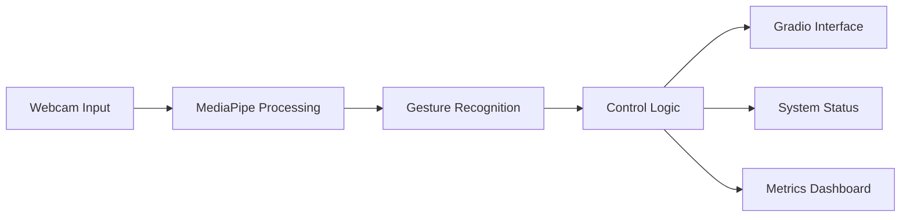

# Smart Factory Control System 🏭

[](https://www.python.org/downloads/release/python-3116/)
[](https://opencv.org/)
[](https://mediapipe.dev/)
[](https://gradio.app/)
[](https://opensource.org/licenses/MIT)

> A modern gesture-controlled smart factory interface using computer vision and machine learning 🤖


## 🌟 Features

- 🎥 Real-time gesture recognition using MediaPipe
- 🏭 Industrial control system simulation
- 📊 Live production metrics and quality control
- 🚨 Emergency stop functionality
- 📈 Performance monitoring
- 🌐 Web-based interface using Gradio

## 🎮 Gesture Controls

| Gesture | Action | Description |
|---------|--------|-------------|
| ✌️ Peace | Start Production | Initiates the production line |
| ✋ Palm | Quality Check | Performs quality inspection (Hold for 3s to reset Emergency) |
| 👊 Fist | Emergency Stop | Immediately halts all operations |

## 🚀 Quick Start

1. **Clone the repository**
   ```bash
   git clone https://github.com/Arittra-Bag/Smart_Factory.git
   cd Smart_Factory
   ```

2. **Install dependencies**
   ```bash
   pip install -r requirements.txt
   ```

3. **Run the application**
   ```bash
   python smart_factory_gradio.py
   ```

## 💻 System Requirements

- Python 3.11
- Webcam access
- Modern web browser
- 4GB RAM minimum
- Windows/Linux/MacOS

## 📊 Performance Metrics

The system tracks:
- Production count
- Quality score
- Defect detection
- System status
- Current gesture
- Real-time FPS

## 🔧 Configuration

The application automatically:
- Detects and uses the default webcam
- Adjusts to available system resources
- Saves performance metrics
- Handles multiple hand gestures

## 🛠️ Technical Architecture



## 🤝 Contributing

Contributions are welcome! Please feel free to submit a Pull Request.

## 📝 License

This project is licensed under the MIT License - see the [LICENSE](LICENSE) file for details.

## 🙏 Acknowledgments

- MediaPipe team for their excellent hand tracking solution
- Gradio team for the intuitive web interface framework
- OpenCV community for computer vision tools

## 📞 Contact

For questions and support, please open an issue or contact the maintainers.

---
Made with ❤️ by [Arittra Bag](https://github.com/Arittra-Bag) 